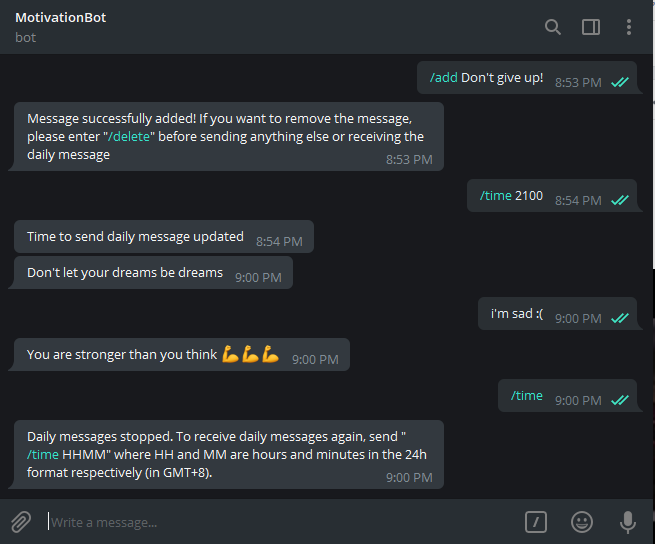

# MotivationBot
This bot is a community-run bot of motivational quotes, uplifting messages and other wholesome text. 

Deployed on Heroku.

Note that not all deployed code is pushed here, for security reasons. This includes admincommands.py, token.json, and the database information in dbhelper.py, 

Made with much help from this [tutorial](https://www.codementor.io/garethdwyer/tutorials/building-a-telegram-bot-using-python-part-1-goi5fncay), Heroku documentation, Telegram API and StackOverflow.

## How to use
Add the bot at t.me/DailyMotiBot and start it as prompted.  

By default, the bot will send you a random message from the database at 9pm (GMT+8) daily. The daily message may not be sent 
if the bot has been inactive for half an hour or longer since it is hosted on a free server.
 
To change the time this happens, send "/time HHMM" where HH and MM are hours and minutes in the 24h format respectively.  
To disable the daily messages, simply send "/time".

To contribute to the database, send "/add <your message>" and it will be saved into the database.  

If you feel that the last message that our bot sent to you (or the message that you just submitted) is inappropriate, 
send "/delete" and it will be removed.